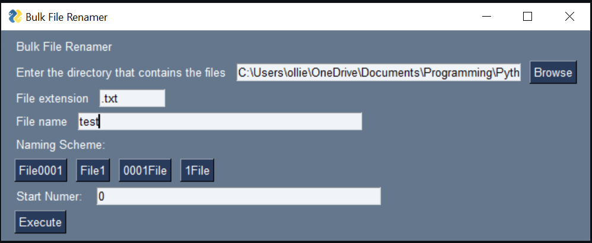

# Bulk File Renamer
Renames all the files with the same extension in a directory

# Instilation
Run 
`pip3 install -r requirements.txt`
in the directory where the repository is cloned.

# Usage
To run this run main.py and a window will appear.

